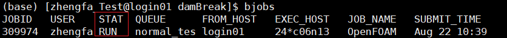
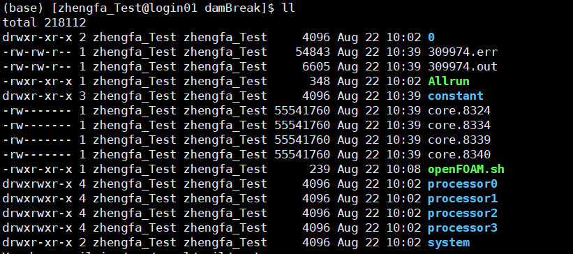

OpenFoam
=================================

.. hint:: 更多样例代码尽在/seu_share/home/examples

.. toctree::
   :maxdepth: 2
   :caption: 目录:

1. 使用cp命令拷贝样例openFOAM文件夹到用户目录下。

.. code-block:: 

   cp -R /seu_share/home/examples/openFOAM/ ./

2. 进入openFOAM/damBreak目录。

.. code-block:: 

   cd openFOAM/damBreak

3. 使用cat命令查看脚本内容。

.. code-block:: 

   cat openFOAM.sh
 
.. hint:: 脚本含义请查看常用命令

4. 使用bsub命令提交作业。

.. code-block:: 

   busb < openFOAM.sh

提交作业后会返回jobid。

.. hint:: normal_test队列仅供测试使用，正式使用请选择其他队列。

5. 使用bjobs查看作业状态。

 
6. 作业执行完成后会生成jobid.out文件。

